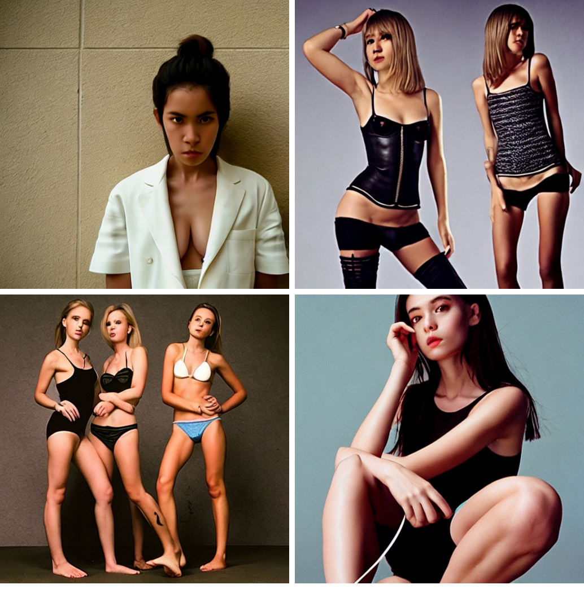

# 对AltDiffusion的TextEncoder的Finetune

## 数据准备
下载数据：(Arknights)[https://huggingface.co/datasets/ArielACE/Arknights-Diffusion-Dataset]

数据转换，调用meta_file_converter.py
```
python meta_file_converter.py --image_dir ${IMAGE_DIR} --output_dir ${OUTPUT_DIR}
```

其中IMAGE_DIR为下载的数据集的train_data图片文件夹，OUTPUT_DIR为输出文件夹。OUTPUT_DIR是我们用于调优的数据集。

## 模型准备
作为对比，准备了两个版本的模型。
1. 在TextEncoder之后，添加一层Linear的MLP版本。
2. 在TextEncoder之前，为每个input text添加一个100 embedding的prompt embedding版本。

训练脚本分别是：

MLP版本：
```python
python.exe .\text_encoder_util_mlp_transfer.py --data_dir F:\data\Arknights-Diffusion-Dataset\train_image\ --model_path F:\models\huggingface\AltDiffusion-m9\ --ckpt_dir F:\data\Arknights-Diffusion-Dataset\ --batch_size 3 --mixed_precision no  --max_train_steps 18300 --allow_tf32 --resolution 512 --name altm9-single-layer --num_layers 1
```
Prompt版本
```python
python.exe .\text_encoder_util.py --data_dir F:\data\Arknights-Diffusion-Dataset\train_image\ --model_path F:\models\huggingface\AltDiffusion-m9\ --ckpt_dir F:\data\Arknights-Diffusion-Dataset\ --batch_size 6 --mixed_precision bf16  --max_train_steps 24000 --allow_tf32 --resolution 512 --name altm9-prompt-embedding --num_prompts 100
```

由于MLP版本在Accelerate上训练没有办法使用半精度训练，所以batch_size只能设置为3，而Prompt版本可以使用半精度训练，所以batch_size设置为6。

最终获得的模型大小为：

MLP版本：2.25M last-checkpoint-mlp-altm9-single-layer-1-18301.pt

Prompt版本：400K last-checkpoint-mlp-altm9-single-layer-1-18301.pt

相对于LoRa调优，有需要增加的参数对比，这两个版本是相当的小了。

## 模型评估

对于图像生成，我们评估的指标非常的主观。因此这里主要用经过调优的模型生成的图片和未经过调优的模型的图片进行对比。

得益于两种训练方式都是无侵入式的，因此同一个程序，可以同时生成调优过和未调优过的模型生成。

同时，由于该训练集用词非常独特，我自己很难想象出来这些词的含义，所以我写了一个小程序，从训练数据的tags里面，随机抽取一些，作为我们评估的文字。该程序名为：prompts_generator.py

生成的steps，设置为100，每次生成4张图片以作评估。

MLP版本的生成程序为：text_encoder_gen_show_mlp.py

Prompt版本的生成程序为：text_encoder_gen_show.py

生成的图片如下：

|编号|提示文本|MLP版本|Prompt版本|原始版本MLP|原始版本Prompt|
|:---:|:---:|:---:|:---:|:---:|:---:|
|0|1girl,solo,flying sweatdrops,on couch,holding knife,soles,v,tentacle pit,dancing,hat,yellow background,skindentation,sleeveless shirt,feet out of frame,pouring onto self,closed eyes,collarbone,ahoge,clothes lift,halo,single hair bun,blurry background,artist name,fake animal ears,blood,short dress,kneeling,torn legwear,red bow,short shorts,tail,drinking glass,embarrassed,playing card,outstretched arms,crossed arms,bandaids on nipples,cosplay,signature,holding can,legs up,red necktie,ass visible through thighs,glasses,handgun,soaking feet,bathing,pumpkin,areola slip,bow,black shorts,red background|||||
|1|1girl,solo,red bra,enmaided,rubber duck,pouring onto self,between breasts,facial mark,torn pants,short dress,bikini,smoke,close-up,frilled bikini,holding bag,black bowtie,diamond (shape),two-sided fabric,black choker,building,ahoge,parody,barcode,eyeshadow,kimono,candlestand,cleavage,long fingernails,off-shoulder sweater,backless leotard,upper teeth,shoe soles,halloween,fur collar,black sweater,red bow,sleeveless,drunk,high heels,black socks,drinking straw,wings,pink background,standing,holding knife,pumpkin,against wall|||||
|2|1girl,solo,halo,bottomless,cat,bag,criss-cross halter,greyscale,closed eyes,open jacket,white gloves,red ribbon|||||
|3|1girl,solo,bikini under clothes,maid,black pantyhose,bat (animal),spread legs,bug,naked jacket,off shoulder,grenade launcher,backless leotard,strap pull,candy,collarbone,fake animal ears,two-sided skirt,braid,sweater,petals,monochrome,split,grey scarf,leotard aside,soles,bra,halloween,poolside,black background,stomach,card,strapless dress,cowboy shot,chinese text,ahoge,tail through clothes,cocktail dress,restrained,chain,upper body,tile floor,under-rim eyewear,gun,1boy,pouring onto self,hands up,multi-strapped bikini,cloudy sky,back,head rest,bow,strapless leotard,grey background,glasses,playing card,symbol-shaped pupils,simple background,breasts out,black camisole,evening gown,drinking straw,grey pants,alternate hairstyle,rubber duck,holding umbrella,pouch,long sleeves,v,beer,shawl,potted plant,bound arms,bandages,crossed arms,scarf,fingerless gloves,swimsuit cover-up,book,white apron,tattoo,thighband pantyhose,notice lines,:o,soaking feet,computer,arms under breasts,reflection,one knee,chromatic aberration,cum,covered navel,sparkle,rose,tearing up,underwear,topless,long hair,sky,sleeveless shirt,bare legs,red bra,penis|||||
|4|1girl,solo,head tilt,front-tie bikini top,invisible chair,explosion,holding card,cowbell,sarashi,animal ears,strapless leotard,black scarf,pussy juice,bandaid,zoom layer,pointing,cocktail glass,thighs,gloves,choker,black shorts,one knee,bath,tears,soaking feet,neck bell,short dress,symbol-shaped pupils,multiple views,sideboob,short sleeves,hair flower,tile floor,kneepits,computer,pillow,covered navel,foot out of frame,hands on hips,open clothes,streaked hair,diamond (shape),sex machine,sleeveless dress,ring,tentacles under clothes,handgun,toenails,grenade launcher,gas mask,torn legwear,midriff,frills,collarbone,tentacle sex,holding knife,ocean,debris,tail,close-up,dated,grey background，非常详细，数字绘画，概念艺术，敏锐的焦点，插图|||||
|5|1girl,solo,bare back,hood,completely nude,tentacles,animal ear fluff,licking lips,arm behind back,card,arms under breasts,turtleneck,hand on own cheek,assault rifle,bare arms,hat,neck bell,\m/,english text,black dress,front-tie bikini top,bottle,gradient dress,twintails,jacket removed,red gloves,armpits,soaking feet,:q,open clothes,cleavage,penis,twitter username,cup,bandaged leg,arms up,white apron,ahoge,black camisole,white dress,fang,grin,tearing up,knife,sweat,+ +,diamond (shape),shadow,thighs,pool,japanese clothes,topless,book,hair ribbon,bound arms,crossed arms,symbol-shaped pupils,thigh gap,plaid skirt,playing card,drinking glass,fire,makeup,black shorts,remote control,witch hat,halterneck|||||
|6|1girl,solo,bare back,hood,completely nude,tentacles,animal ear fluff,licking lips,arm behind back,card,arms under breasts,turtleneck,hand on own cheek,assault rifle,bare arms,hat,neck bell,\m/,english text,black dress,front-tie bikini top,bottle,gradient dress,twintails,jacket removed,red gloves,armpits,soaking feet,:q,open clothes,cleavage,penis,twitter username,cup,bandaged leg,arms up,white apron,ahoge,black camisole,white dress,fang,grin,tearing up,knife,sweat,+ +,diamond (shape),shadow,thighs,pool,japanese clothes,topless,book,hair ribbon,bound arms,crossed arms,symbol-shaped pupils,thigh gap,plaid skirt,playing card,drinking glass,fire,makeup,black shorts,remote control,witch hat,halterneck|||||
|7|1girl,solo,black bikini,on side,witch hat,white leotard,portrait,panties under pantyhose,partially submerged,toenails,pussy juice,strap,torn shirt,m4 carbine,shadow,chair,fellatio,off shoulder,umbrella,w,index finger raised,:d,lace-trimmed bra,parted lips,crop top,head tilt,copyright name,qing guanmao,red bikini,closed eyes,open clothes,gradient background,bottle,solo focus,chromatic aberration,grey sky,white gloves,bandaids on nipples,bell,holding camera,cropped torso,fangs,tearing up,glasses,thigh gap,nipple tweak,expressionless,sunset,ring,candlestand,high-waist pants,wine bottle,arms behind back,+ +,scar on arm,slit pupils,grin|||||
|8|1girl,solo,no bra,pool,horns,chibi,no shoes,one knee,rubber duck,choker,from side,wings,from below,hand on hip,white rose,bikini,arms behind back,sideways glance,single hair bun,bridal gauntlets,bodystocking,witch hat,black choker,hanging breasts,tutu,black nails,solo focus,red ribbon,foot focus,indoors,arm up,hairclip,underwear,shushing,backless outfit,maid headdress,full body,black shirt,plant,embarrassed,bikini under clothes,arm strap,green background,nose blush,bug,simple background,dildo,hand on own cheek,monochrome,two-tone hair,black jacket,curtains,clothes lift,completely nude,trick or treat,nude,sandals,snow,bare legs,saliva,silk,clothes pull,pussy juice,object insertion,candy,earrings,underboob|||||
|9|1girl,solo,skirt lift,wine glass,alcohol,heart-shaped pupils,thighband pantyhose,high heels,navel cutout,apron,condom,shawl,black-framed eyewear,bomb,smile,strap pull,silk,chest sarashi,full body,bell,bikini,wet,frills,sandals,pillow,jacket removed,shorts,handgun,covered navel,panties under pantyhose,hands on hips,smoke,strapless leotard,spaghetti strap,cosplay,underboob,against wall,diamond (shape),swimsuit cover-up,red gloves,squatting,explosion,heart cutout,dancing,red hair,leotard,miniskirt,invisible chair,blood,:p,monochrome,from above,bound wrists,sitting,vibrator,pussy juice,copyright name,necklace,:o,black shirt,mosaic censoring,soles,hand on own chest,split,used condom,strapless,hand on hip,chibi,injury,bandaids on nipples,hair ornament,bow|||||
|10|1girl,solo,?,pants,arm strap,torn legwear,tears,profile,arms behind head,lace-trimmed bra,very long hair,couch,sharp teeth,looking back,looking to the side,foot focus,torn clothes,hair ribbon,bow,split,can,chained,swimsuit,food,toenails,alternate hair length,explosive,head tilt,sleeveless shirt,hetero,oral,red bikini,rabbit ears,pool,sarashi,red bowtie,armchair,assault rifle,fangs,arms up,arms behind back,shelf,black shorts,ballet,bound arms,bikini top only,black background|||||


## 对比的结论

1. 对比MLP和Prompt版本，MLP要求输入更接近测试数据的长度。如果太短，如4， MLP就会表现出细节缺失。很有可能是因为MLP是后映射，而Prompt是输入端的embeddings参与了完整的encoder的多层transformer的attenting过程。
2. 即使添加原有模型已有的文本能力，也不影响生成表现。相对来说，在标签外文本加入的情况下，Prompt表现更好一些。
3. 不管MLP还是Prompt版本，Step步数最少应该100步，否则噪音去除效果就比较差。也有可能是训练的时间不够。两个模型训练时间都在两到三个小时之间。
4. 很明显，原有模型完全看不懂这些单词的含义，生成出来的图片南辕北辙。而MLP和Prompt均让模型理解了单词含义，按照我们预期的方向生成。
5. 经过MLP和Prompt映射之后，只能生成该领域图片了。输入任何训练标签之外的词语，都不再会生成原有模型接近的图片了，且生成的质量比较低。不过由于原模型未经改变，一个模型可以搭配各种不同的MLP和Prompt，生成不同的图片。这也是我们的目的之一。
   1. 对比输入：黑暗精灵公主，非常详细，幻想，非常详细，数字绘画，概念艺术，敏锐的焦点，插图
      1. 调优后的MLP：
      2. 原始的AltM9：
6. AltDiffusion由于把原来的ClipTextEncoder更换成了Roberta系列，让语言模型在生成过程中能够更好理解文本输入，语言模型所容纳的语义也更为广泛。因此能够做到以语言模型为中心进行调优。因此接下来的文本指导图像生成的方向，还是应该以大语言模型为中心扩展能力。
